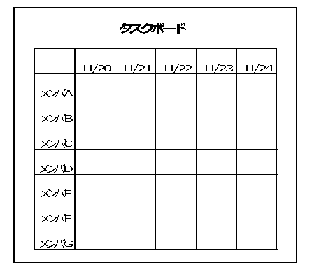

# タスクボード運用ガイド

# 1. 本書について

本書は、スクラム開発におけるタスクボードの速やかな導入、効果的な運用を促進するためのガイドです。

> **Note:**  
> タスクボードとは、それぞれの持つタスクを可視化し、TODO管理を行うツールのことです。  
> 本ガイドでは、メンバー名を縦軸、スプリント期間を横軸にとった模造紙に、  
> 開発チームが担当するタスクを記載した付箋を貼りつけていく形式のものをタスクボードとして説明を行います。  
> （※ 詳細は**2.1.1. タスクボードの作成** を参照）

## 1.1. 目的
本書の目的は以下の2点です。
* **スクラム開発へタスクボードを速やかに導入できるようにすること**
* **タスクボードを効果的に運用し、チーム作業を効率化できるようにすること**

## 1.2. 前提事項
本書は、以下の前提事項 に基づいて記載しています。

* Redmineやその他のタスク管理ツールが使用できない環境
* プロジェクト関係者以外の人が入ることのできない環境（例えば、専用のプロジェクトルーム内）
* タスクボードのみでタスクの運営を実施する

> **Note:**  
> 付箋によるタスクボードの運用は、プロジェクトの内部事情をフロア内の全員に公開することになります。  
> そのことを十分に理解して運用してください。

## 1.3. 想定読者
* **スクラムマスター**
* **開発チームメンバー**

# 2. 導入・運用方法

## 2.1. 導入
本章では、タスクボード運用の導入手順について説明します。

### 2.1.1. タスクボードの作成

模造紙やホワイトボードに、縦軸にメンバー名、横軸にスプリント日数分の情報が収まるような表を作成します。  
以下は、1週間1スプリント、全7人の開発チームの場合の例です。

### 2.1.2. 担当のタスクをばらす

スプリント内で取り組むことになったストーリーについて、タスクバラシを行います。  
タスクバラシをする際は、スプリント運営ガイドの下記章を参考にしながら進めてください。

* [スプリント運営ガイド](https://github.com/Fintan-contents/sprint-operation-guide/blob/master/README.md)  
 　L  [スプリントの運営](https://github.com/Fintan-contents/sprint-operation-guide/blob/master/rhythm.md)  
　　　L **[スプリントミーティング 第2部](https://github.com/Fintan-contents/sprint-operation-guide/blob/master/rhythm.md#%E7%AC%AC2%E9%83%A8)**

### 2.1.3. タスクをタスクボードに展開する

付箋などを用いて、ばらしたタスクをタスクボードに展開してください。  
以下は、実際にプロジェクトで使用した「タスクボード」と「分割タスクの記載」の例です。
  
  
    
  

## 2.2. 運用
ボードに展開したタスクは、デイリースクラムで報告する必要があります。  
また、スプリント進行中に、自分の実施している作業とボードに展開している作業に乖離が生じていると感じた場合は、  
全体のスケジュールも踏まえたうえで、タスクの整合性を確認する必要があります。

> **Note:**  
> **タスクバラシはスプリント開始時に、すべてのタスクをもれなくばらしておくものです。**  
> どれだけやってもタスクの過不足が発生する場合、タスクの修正を実施する必要があります。  
> より過不足の少ない（精度の高い）バラシを実施するための工夫例は**「3.タスクバラシの精度を上げるために」**で説明します。

以下に、タスクボードの運用手順を説明します。

### 2.2.1. タスクが完了したとき

ボードに展開しているタスクが完了したら、付箋をはがしたり印をつけたりする事で、その旨がわかるようにします。  
こうすることで、タスクの状況（未実施、実行中、完了など）を自他共に確認しやすくなります。

### 2.2.2. スプリント中にタスクの過不足を検知したとき

スプリントの進行中に、ボードに展開している作業だけではタスクが不足していると感じた場合は、  
必要なタスクの追加やそれぞれのタスクにおけるアサインの見直しを実施してください。

また、ボードに展開したタスクと別の作業をしている、実施不要なタスクが存在しているときも、不要なタスクの削除や空白となった工数への再見積りが必要です。

### 2.2.3. デイリースクラム

毎デイリースクラムにおいて、昨日実施したタスクと今日実施する予定のタスクについて報告します。

遅延タスクや前倒しタスクがある場合も報告し、  
遅延タスクについてはいつまでにキャッチアップ可能かを開発チーム内に周知させておくようにしてください。

もし、1人でのキャッチアップが難しい場合は、チームとしてどのようにリカバリを行うかについて検討してください。

# 3. タスクバラシの精度を上げるために  
タスクボードによるタスク管理はスプリントを重ねて運用を繰り返す中で、その見積りの精度を見直し、向上できます。

一方、その反復性、再利用性を意識せずに使用すると、  
単純にスプリント期間内のスケジュールを確認するだけのツールとなってしまいます。

本章では、タスク管理の再利用性を活用するための工夫について例を交えて説明します。

## 3.1. タスクテンプレート
タスクテンプレートとは、プロジェクトにおいて開発チームメンバーが行う一般的なタスクを洗い出したものです。

タスクバラシを実施する際にタスクテンプレートを参考にすることで、必要最低限のタスクの細分化を実施することができます。

* **タスクテンプレートを利用しても、突発タスクや未実施のタスクが発生する場合**  
この場合、発生したタスクがそのスプリント特有のタスクなのかどうか検討してください。  
もし、スプリントに限らず一般的に必要と思われる場合のみ、タスクテンプレートを修正してください。

このようにスプリント終了ごとに予定外タスクの見直しを実施することで、バラシの精度を上げていくことができます。

以下は、「タスクテンプレート」の例です。  

## 3.2. タスクの実績を電子媒体で管理する
タスクボードに展開したタスクを、Excelなどの媒体で管理すると、見積ったタスクの計画に対する消化状況を容易に確認できます。  
上記管理方法の一例として、バーンダウンチャートがあります。

バーンダウンチャートとは、「見積ったすべての作業が期限までに完了できるかどうか」を可視化したグラフです。  
横軸に日付、縦軸に時間をとり、スプリントで見積った作業の残り時間をグラフに計上します。

スプリント期間内に突発タスクが発生しなかった場合、  
グラフはスプリント開始日に最大となり、最終日に近づくにつれてグラフが0に近づくような右肩下がりのグラフとなります。

バーンダウンチャートを用いることで、各スプリントの全体作業時間や作業の進捗状況をより正確に把握することができます。

以下は、「バーンダウンチャート」の例です。  

# 4. 運用にともなう注意点
本章は、タスクボードの運用を進めていくうえで、特に留意すべき点について説明します。  
運用継続のために、必要と感じた内容が発生次第、順次追加していくことが理想です。

* **他人のスケジュールにも気を配ること**  
デイリースクラムでは自分の進捗報告だけでなく、他メンバーの進捗も確認し、  
作業の重複や非効率な作業分担に気づけるようにしてください。

> **Note:**  
> 自分のタスクを完成させて終了。ではなく、他メンバーの作業と自分の作業の妥当性について確認するつもりで臨んでください。

* **自分だけでなく、チームメンバーにも理解できるように記載すること**  
デイリースクラムで透明性のある報告を行うためにも、  
タスク内容を第三者がひと目見て理解できるように記述してください。

* **タスクボードのセキュリティ管理に注意すること**  
付箋によるタスクボードの運用は、プロジェクトの内部事情をフロア内の全員に公開することになります。（2回目）  
関係者以外が確認できない環境（例えば、専用のプロジェクトルーム内）での運用を前提としてください。

# ライセンス

この 作品 は <a rel="license" href="http://creativecommons.org/licenses/by-sa/4.0/">クリエイティブ・コモンズ 表示 - 継承 4.0 国際 ライセンス</a>の下に提供されています。
 

