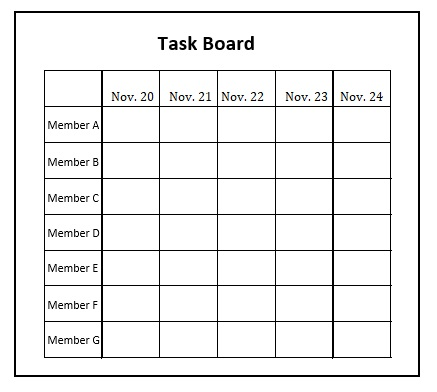

# Taskboard guide

# 1. About this document

This document is a guide on how to quickly introduce and effectively use a task board in Scrum development.

> **Note:**  
> A task board is a tool to visualize each team member’s tasks and manage their to-do lists.  
> The explanations in this guide assume that the task board will consist of a piece of simili paper with the team member’s names as row headings and each day during the sprint period as a column heading,  
> and that the tasks to be completed by the development team will be attached with sticky notes.  
> (See **2.1.1 Creating a task board** for details.)

## 1.1. Purpose
This document has two purposes:
* **To enable a task board to be introduced quickly in Scrum development**
* **To enable effective use of the task board to improve the efficiency of the team’s work**

## 1.2. Assumptions
This document assumes the following points:

* That Redmine and other task management tools cannot be used in your environment
* That the environment is a location that can only be entered by personnel involved with the project (e.g. a dedicated project room)
* That only the task board will be used to manage tasks

> **Note:**  
> Sticky notes are used on the task board so that the internal information on the project is visible to everyone on the floor.  
> This point needs to be fully understood when using the task board.

## 1.3. Intended readers
* **Scrum masters**
* **Development team members**

# 2. How to introduce and use a task board

## 2.1. Introduction
This section explains how to introduce a task board for use in Scrum.

### 2.1.1. Creating a task board

Draw a table on simili paper or a whiteboard, with the team members names as row headings and the days in the sprint as column headings.  
Below is an example of a table for a one-week sprint with a seven-member development team.

### 2.1.2. Planning and decomposing tasks among team members

Plan and decompose tasks for the stories that will be handled during the sprint.  
Refer to the following chapter in the "Sprint operation guide" when planning and decomposing tasks.

* [Sprint operation guide](https://github.com/Fintan-contents/sprint-operation-guide/blob/master/README.md)  
 　L  [Sprint operation](https://github.com/Fintan-contents/sprint-operation-guide/blob/master/rhythm.md)  
　　　L **[Sprint meeting: Part 2](https://github.com/Fintan-contents/sprint-operation-guide/blob/master/rhythm.md#%E7%AC%AC2%E9%83%A8)**

### 2.1.3. Arranging the tasks on the task board

Arrange the planned and decomposed tasks on the task board using sticky notes or similar.  
Below is an example of a real task board used in a project, with the planned and decomposed tasks attached.
  
  
    
  

## 2.2. Use
The tasks arranged on the board need to be reported on during daily scrums.  
If a team member feels that the work they are doing is not aligned with the arrangement of tasks on the board,  
the compatibility of the tasks needs to be confirmed based on the schedule as a whole.

> **Note:**  
> **All tasks must be planned and decomposed with no omissions before starting each sprint.**  
> If there are too many or too few tasks despite best efforts, the tasks need to be revised.  
> **"3. Improving the accuracy of task planning and decomposition"** explains examples of how to plan and decompose tasks so that there are fewer cases of too many or too few tasks (improve accuracy).

Below is an explanation of how to use a task board.

### 2.2.1. When tasks are completed

When each of the tasks arranged on the board is completed, remove or mark the sticky note to indicate that the task is completed.  
This makes it easy for team members to see the status of their and their team members’ tasks (not done, doing, done, etc.).

### 2.2.2. If you find that there are too many or too few tasks in a sprint

If you find that the tasks on the board do not cover all of the work that needs to be done,   
add tasks that are needed or review how each task is assigned.

The same principle applies if there are tasks that do not need to be done and the team is doing different work from the tasks arranged on the board. Remove unnecessary tasks and perform another estimate for the man-hours that are now blank.

### 2.2.3. Daily scrums

In each daily scrum, the team reports on the tasks they did the day before and the tasks they will do in the day ahead.

If any tasks are being delayed or done early, this needs to be reported on too.  
If a task is delayed, they should explain to the development team about when they will be able to catch up.

If it will be difficult for the team member to catch up on their own, decide on recovery measures to be executed by the team.

# 3. Improving the accuracy of task planning and decomposition  
The accuracy with which the working time of tasks is estimated can be improved through ongoing use of the task board to manage tasks during each sprint.

However, if attention is not paid to the repetition and reuse that a task board enables,  
the task board will simply become a tool for checking the schedule throughout each sprint.

This section provides examples of how to make the most of the way task boards can be reused in task management.

## 3.1. Task templates
Task templates are used to identify general tasks to be performed by each member of the development team throughout the project.

Referring to a task template when planning and decomposing tasks makes it possible to break tasks down to the smallest size necessary.

* **If sudden or uncompleted tasks occur even when using a task template**  
If this issue occurs, determine whether the task is specific to the current sprint.  
Only amend the task template if the task is likely to apply throughout the project, not just during the current sprint.

Reviewing unexpected tasks at the end of each sprint will improve the accuracy with which tasks are planned and decomposed.

Below is an example of a task template.  

## 3.2. Managing task results using digital media
Managing the tasks arranged on the task board with media such as Excel makes it easy to see whether tasks are being completed during the time estimated in the plan.  
A burndown chart is an example of this kind of management.

A burndown chart is a graph that visualizes whether all of the estimated tasks can be completed in time.   
Using the X axis for the date and the Y axis for the time, this graph shows the time remaining for the work estimated for the current sprint.

If no sudden tasks occur during the sprint,  
the line on the graph is at its highest on the first day and then moves down to zero as the final day approaches.

Using a burndown chart makes it possible to accurately assess the overall working time for each sprint and the progress of the work during the sprint.

Below is an example of a burndown chart (note that this is based on a Japanese schedule, where Christmas is not a public holiday).   

# 4. Points of caution when using a task board
This section explains points that require attention when using task boards.  
Ideally, tasks should be added as soon as they become necessary in order to continue using the task board effectively.

* **Be conscious of other people’s schedules**  
Daily scrums should be used not only to report on your own progress but to confirm that of the other team members.  
Pay attention to double work and inefficient allocation of work.

> **Note:**  
> Do not focus only on finishing your own tasks. Approach this with the intention to confirm whether your own work and that of the rest of the team is being allocated in a viable way.

* **Write your tasks in a way that is clear to the whole of the team**  
Write your tasks in a way that enables third parties to see at a glance what needs to be done.  
This also improves transparency in the reports given at daily scrums.

* **Pay attention to the security of the task board**  
As mentioned earlier, since this management method consists of sticky notes on a task board, everyone on your floor can see internal information about the project.  
Make sure that the task board will only be visible to the relevant parties (e.g. use it in a dedicated project room).

# Licensing

This document is provided under the <a rel="license" href="http://creativecommons.org/licenses/by-sa/4.0/">international Creative Commons Attribution-ShareAlike 4.0 license</a>.
 

